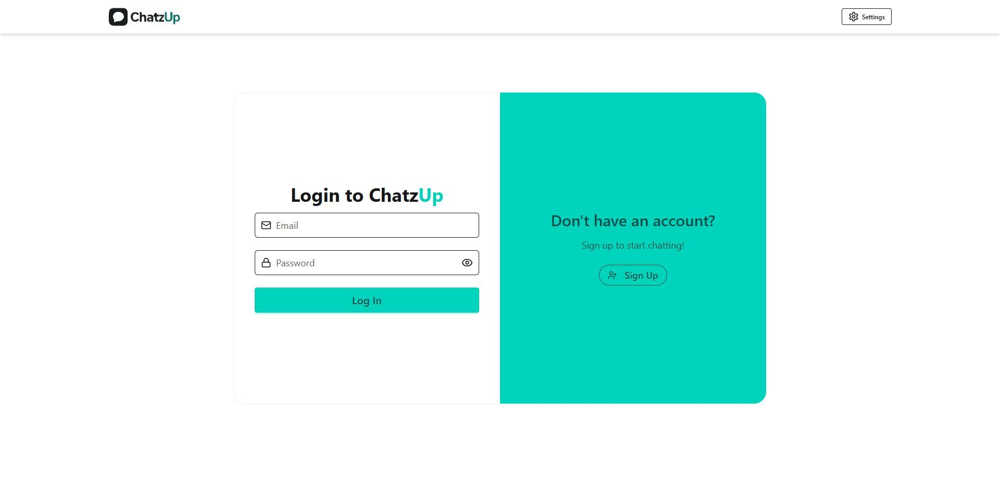
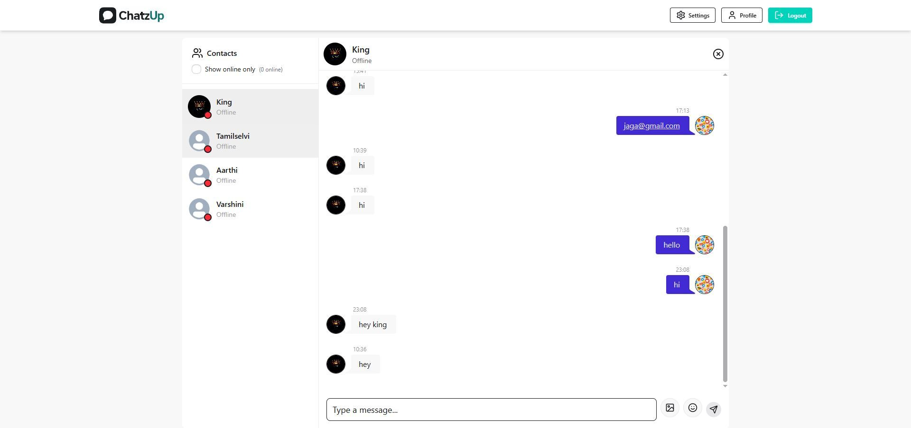
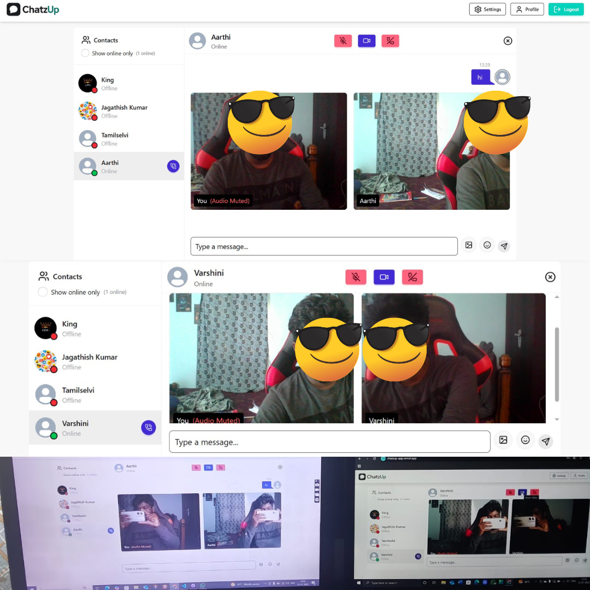
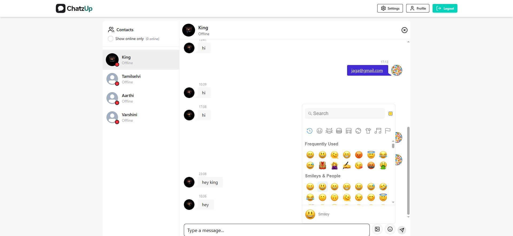

# 💬 ChatzUp — Real-Time Chat & Video Calling App Version 1.0


[](LICENSE)

ChatzUp is a modern, full-stack real-time chat and video calling application built with **React 19**, **Node.js**, **Express 5**, **MongoDB**, **Socket.IO**, and **WebRTC**. It allows users to exchange messages, share images, use customizable emojis, initiate audio/video calls with mute syncing, manage profiles, and enjoy real-time features like typing indicators and online presence.

---

## 📸 Screenshots

| Login & Signup | Chat Interface | Video Call | Emoji Picker |
| ---------------| ---------------|------------|--------------|
|  |  |  |  |

---

## ✨ Features

- 🔐 **User Authentication**: Secure login/signup with JWT and cookies.
- 💬 **Real-Time Messaging**: Instant messaging with Socket.IO, including message deletion.
- 📷 **Image Sharing**: Upload and compress images (up to 1MB, 1024px max) with preview and progress.
- 😂 **Emoji Support**: Emoji picker with Twitter style, skin tone selection, and outside-click closure.
- 🎥 **Audio & Video Calls**: WebRTC-based calls with mute/unmute syncing.
- 🟢 **Online Presence**: Real-time user status updates.
- 👤 **Profile Management**: Upload profile pictures and change passwords via Cloudinary.
- 🌙 **Theming**: Customizable UI with DaisyUI and Tailwind CSS.
- 🔁 **Typing Indicators**: Debounced typing status with Socket.IO.
- 📊 **State Management**: Efficient state handling with Zustand.

---

## 🧱 Tech Stack

### Frontend

- React 19 (Beta)
- Vite + Tailwind CSS + DaisyUI
- Zustand, Axios, emoji-picker-react
- react-hot-toast, react-router-dom v7
- clsx, lodash, dompurify
- WebRTC (via webrtc-adapter), Socket.IO-client

### Backend

- Node.js, Express 5 (Beta)
- MongoDB + Mongoose
- Socket.IO, JWT, bcrypt, cookie-parser
- dotenv, cors
- Cloudinary SDK for image uploads

---

## 📁 Folder Structure

```
/
├── Backend/
│   ├── routes/
│   ├── models/
│   ├── lib/
│   ├── middleware/
│   └── server.js
├── Frontend/
│   └── src/
│       ├── Pages/
│       ├── Components/
│       └── Store/
├── screens/
├── LICENSE
└── README.md
```

---

## 🚀 Deployment

### 🔹 Frontend and Backend (Render)

1. Visit [https://dashboard.render.com/](https://dashboard.render.com/)
2. Click **New Web Service**
3. Connect your GitHub repository: [jagathishkumar/chatzup](https://github.com/Jaga03/Realtime-Chat-Video-Calling-App-V1)
4. Set **Root Directory** to `/`
5. Configure the following build and start commands:

   ```bash
   Build Command: npm install --prefix Backend && npm install --prefix Frontend && npm run build --prefix Frontend
   Start Command: npm run start --prefix Backend
   ```

6. Add the following environment variables in Render:

   ```env
   PORT=5000
   MONGODB_URI=your_mongodb_connection_string
   JWT_SECRET=your_jwt_secret
   CLOUDINARY_CLOUD_NAME=your_cloudinary_cloud_name
   CLOUDINARY_API_KEY=your_cloudinary_api_key
   CLOUDINARY_API_SECRET=your_cloudinary_api_secret
   ```

7. Deploy the service and after successful deployment, use the live URL provided by Render (e.g.,  
   `https://realtime-chat-video-calling-app.onrender.com`)

> ✅ **Note:** Ensure that your backend Express server is configured to serve the frontend's static files (from `Frontend/dist`) for all routes that are not API endpoints.

---

## 🛡️ Environment Variables

### `.env` (Backend)

```env
PORT=5000
MONGODB_URI=mongodb+srv://<username>:<password>@cluster.mongodb.net/chatzup
JWT_SECRET=your-secret-key
NODE_ENV=production
CLOUDINARY_CLOUD_NAME=your-cloud-name
CLOUDINARY_API_KEY=your-api-key
CLOUDINARY_API_SECRET=your-api-secret
```
---

## 🤝 Contributing

1.Fork the repository.
2.Create a feature branch (git checkout -b feature/new-feature).
3.Commit changes (git commit -m "Add new feature").
4.Push to the branch (git push origin feature/new-feature).
5.Open a Pull Request.

---

## 👥 Credits

Created with ❤️ by **Jagathish Kumar** [](https://www.linkedin.com/in/jagathish-kumar-u)
Special thanks to the open-source community for libraries like Socket.IO, WebRTC, and emoji-picker-react.

---

## 📄 License
This project is licensed under the MIT License. See the LICENSE file for details.